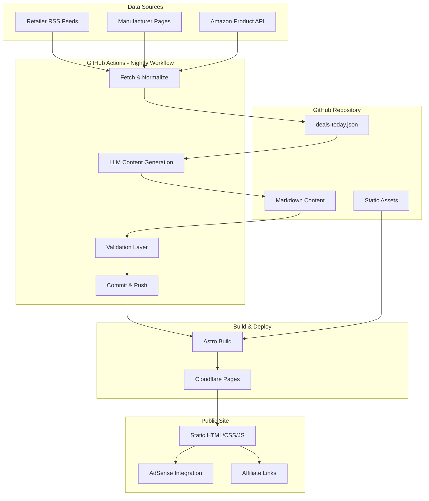
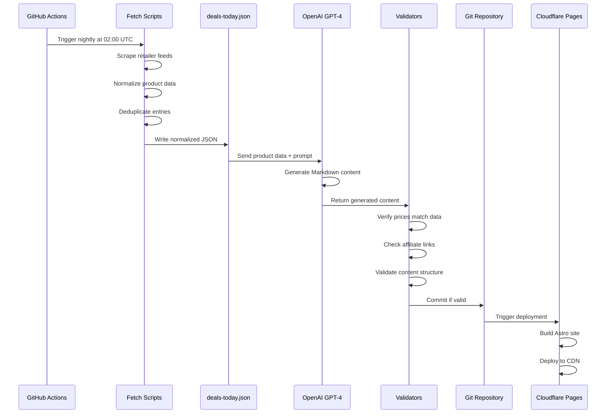

# PlateDrop Architecture & Implementation Plan

## Executive Summary

PlateDrop is an automated content platform that generates daily home gym deal roundups and weekly evergreen guides using LLM-powered content generation, static site deployment, and scheduled CI/CD pipelines.

**Key Technologies:**
- **Frontend:** Astro (static site generator)
- **Backend:** Node.js LTS
- **LLM:** OpenAI GPT-4
- **Hosting:** Cloudflare Pages
- **CI/CD:** GitHub Actions
- **Monetization:** Google AdSense + Affiliate Links

---

## System Architecture



---

## Data Flow Architecture



---

## Directory Structure

```
PlateDrop/
├── .github/
│   └── workflows/
│       ├── nightly-deals.yml          # Daily deal generation
│       └── weekly-guides.yml          # Weekly guide generation
├── content/
│   ├── deals/                         # Daily deal posts (YYYY-MM-DD.md)
│   ├── guides/                        # Evergreen guides
│   └── pages/                         # Policy pages
│       ├── privacy-policy.md
│       ├── affiliate-disclosure.md
│       ├── terms.md
│       └── contact.md
├── data/
│   ├── deals-today.json               # Current normalized deals
│   ├── retailers.json                 # Retailer configs & affiliate rules
│   └── guide-topics.json              # Backlog of guide ideas
├── llm/
│   ├── prompts/
│   │   ├── daily-deals.txt            # Daily roundup prompt
│   │   ├── evergreen-guide.txt        # Guide generation prompt
│   │   └── tip-of-day.txt             # Daily tip prompt
│   └── guards/
│       ├── price-validation.json      # Price matching rules
│       ├── link-validation.json       # Affiliate link rules
│       └── content-rules.json         # Content quality rules
├── scripts/
│   ├── fetch/
│   │   ├── index.js                   # Main orchestrator
│   │   ├── retailers/
│   │   │   ├── amazon.js              # Amazon-specific fetcher
│   │   │   ├── rogue.js               # Rogue Fitness fetcher
│   │   │   └── rep.js                 # Rep Fitness fetcher
│   │   ├── normalizer.js              # Data normalization
│   │   └── deduper.js                 # Duplicate removal
│   ├── generate/
│   │   ├── daily-deals.js             # Daily post generator
│   │   ├── evergreen-guide.js         # Guide generator
│   │   └── llm-client.js              # OpenAI abstraction layer
│   ├── validate/
│   │   ├── price-checker.js           # Verify prices match data
│   │   ├── link-checker.js            # Validate affiliate links
│   │   ├── content-lint.js            # Content quality checks
│   │   └── schema-validator.js        # JSON schema validation
│   └── publish/
│       ├── frontmatter.js             # Add YAML frontmatter
│       └── index-updater.js           # Update homepage index
├── site/                              # Astro project root
│   ├── src/
│   │   ├── components/
│   │   │   ├── Header.astro
│   │   │   ├── Footer.astro
│   │   │   ├── DealCard.astro
│   │   │   ├── AdUnit.astro
│   │   │   └── RelatedPosts.astro
│   │   ├── layouts/
│   │   │   ├── BaseLayout.astro       # Global layout
│   │   │   ├── DealLayout.astro       # Daily deals layout
│   │   │   └── GuideLayout.astro      # Guide layout
│   │   ├── pages/
│   │   │   ├── index.astro            # Homepage
│   │   │   ├── deals/
│   │   │   │   └── [slug].astro       # Dynamic deal pages
│   │   │   ├── guides/
│   │   │   │   └── [slug].astro       # Dynamic guide pages
│   │   │   ├── rss.xml.js             # RSS feed
│   │   │   └── sitemap.xml.js         # Sitemap
│   │   └── styles/
│   │       └── global.css             # Global styles
│   ├── public/
│   │   ├── robots.txt
│   │   ├── favicon.ico
│   │   └── images/
│   └── astro.config.mjs               # Astro configuration
├── tests/
│   ├── fetch.test.js
│   ├── generate.test.js
│   └── validate.test.js
├── .env.example                       # Environment variable template
├── .gitignore
├── package.json
├── README.md
└── RUNBOOK.md                         # Operations guide
```

---

## Component Specifications

### 1. Data Normalization Schema

```json
{
  "id": "rogue-echo-bike-2024",
  "title": "Rogue Echo Bike",
  "brand": "Rogue Fitness",
  "category": "cardio",
  "url": "https://www.roguefitness.com/rogue-echo-bike?tag=AFFILIATE_TAG",
  "image_url": "https://example.com/image.jpg",
  "price_current": 795.00,
  "price_prev": 895.00,
  "discount_pct": 11.17,
  "rating": 4.8,
  "reviews_count": 1247,
  "retailer": "rogue",
  "last_seen_utc": "2024-10-08T22:00:00Z",
  "source_url": "https://www.roguefitness.com/deals"
}
```

### 2. Retailer Configuration Schema

```json
{
  "retailers": [
    {
      "id": "rogue",
      "name": "Rogue Fitness",
      "base_url": "https://www.roguefitness.com",
      "deals_endpoint": "/deals",
      "affiliate_params": {
        "param_name": "tag",
        "tag_value": "env:ROGUE_AFFILIATE_TAG"
      },
      "rate_limit_ms": 2000,
      "parser_type": "html",
      "selectors": {
        "product_container": ".product-item",
        "title": ".product-title",
        "price": ".price-current",
        "prev_price": ".price-was"
      }
    },
    {
      "id": "amazon",
      "name": "Amazon",
      "base_url": "https://www.amazon.com",
      "affiliate_params": {
        "param_name": "tag",
        "tag_value": "env:AMAZON_ASSOC_TAG"
      },
      "use_pa_api": false,
      "parser_type": "manual"
    }
  ]
}
```

### 3. LLM Prompt Templates

**Daily Deals Prompt (`llm/prompts/daily-deals.txt`):**
```
You are a home gym equipment expert writing a daily deals roundup.

STRICT RULES:
1. Use ONLY the provided product data for prices, discounts, and ratings
2. Do NOT invent or estimate any numbers
3. Include affiliate links exactly as provided
4. Keep paragraphs to 2-3 sentences maximum
5. Use friendly, neutral tone - no medical claims
6. No superlatives unless backed by data (e.g., "highest discount")

FORMAT:
- Title: "Home Gym Deals — [Full Month] [Day], [Year]"
- Intro: 2-3 sentences about today's savings
- For each product:
  - H2: [Product Name] + benefit phrase
  - Paragraph: what it is, current price, previous price, discount %, 1-2 features
  - Bullet list: who it's good for (space/budget/training style)
  - Link line: "View deal: [affiliate_url]"
- Outro: 1 tip of the day + price disclaimer

PRODUCT DATA:
{product_json}

Generate the Markdown content now.
```

### 4. Validation Rules

**Price Validation:**
- Extract all price mentions from generated Markdown
- Compare against source JSON data
- Tolerance: ±$0.01 for rounding
- Reject if any mismatch found

**Link Validation:**
- Extract all URLs from Markdown
- Verify domain matches expected retailer
- Verify affiliate parameter present
- Verify parameter value matches env var

**Content Quality:**
- Word count: 800-1200 for deals, 1200-1800 for guides
- Exactly one H1 (title)
- No medical/health claims
- No fabricated specifications
- Unique content (no near-duplicates)

---

## GitHub Actions Workflows

### Nightly Deals Workflow

```yaml
name: Generate Daily Deals
on:
  schedule:
    - cron: '0 2 * * *'  # 02:00 UTC daily
  workflow_dispatch:      # Manual trigger

jobs:
  generate-deals:
    runs-on: ubuntu-latest
    steps:
      - uses: actions/checkout@v4
      
      - name: Setup Node.js
        uses: actions/setup-node@v4
        with:
          node-version: '20'
          cache: 'npm'
      
      - name: Install dependencies
        run: npm ci
      
      - name: Fetch product data
        run: node scripts/fetch/index.js
        env:
          AMAZON_ASSOC_TAG: ${{ secrets.AMAZON_ASSOC_TAG }}
      
      - name: Generate daily post
        run: node scripts/generate/daily-deals.js
        env:
          OPENAI_API_KEY: ${{ secrets.OPENAI_API_KEY }}
      
      - name: Validate content
        run: node scripts/validate/index.js
      
      - name: Commit and push
        run: |
          git config user.name "PlateDrop Bot"
          git config user.email "bot@platedrop.com"
          git add content/deals data/deals-today.json
          git commit -m "Daily deals: $(date +%Y-%m-%d)"
          git push
```

### Weekly Guide Workflow

```yaml
name: Generate Weekly Guide
on:
  schedule:
    - cron: '0 3 * * 1'  # 03:00 UTC Mondays
  workflow_dispatch:

jobs:
  generate-guide:
    runs-on: ubuntu-latest
    steps:
      - uses: actions/checkout@v4
      
      - name: Setup Node.js
        uses: actions/setup-node@v4
        with:
          node-version: '20'
          cache: 'npm'
      
      - name: Install dependencies
        run: npm ci
      
      - name: Select guide topic
        run: node scripts/generate/select-topic.js
      
      - name: Generate guide
        run: node scripts/generate/evergreen-guide.js
        env:
          OPENAI_API_KEY: ${{ secrets.OPENAI_API_KEY }}
      
      - name: Validate content
        run: node scripts/validate/index.js
      
      - name: Commit and push
        run: |
          git config user.name "PlateDrop Bot"
          git config user.email "bot@platedrop.com"
          git add content/guides
          git commit -m "New guide: $(cat .guide-title)"
          git push
```

---

## Astro Configuration

### Key Features to Implement

1. **Content Collections:**
   - Define collections for deals and guides
   - Type-safe frontmatter validation
   - Automatic sorting by date

2. **SEO Optimization:**
   - Unique meta titles and descriptions
   - Open Graph tags
   - JSON-LD structured data
   - Canonical URLs

3. **Performance:**
   - Image optimization with Astro Image
   - Lazy loading for images
   - Minimal JavaScript
   - CSS minification

4. **RSS & Sitemap:**
   - Auto-generated sitemap.xml
   - RSS feed for deals
   - Proper lastmod dates

---

## Environment Variables

Required secrets (GitHub Secrets & Cloudflare):

```bash
# LLM
OPENAI_API_KEY=sk-...

# Affiliate
AMAZON_ASSOC_TAG=yoursite-20
ROGUE_AFFILIATE_TAG=...
REP_AFFILIATE_TAG=...

# Site Config
PRIMARY_SITE_URL=https://platedrop.fit
SITE_NAME=PlateDrop - Home Gym Deals & Tips

# Analytics (after approval)
GOOGLE_ADSENSE_CLIENT_ID=ca-pub-...
GOOGLE_SEARCH_CONSOLE_VERIFICATION=...
BING_WEBMASTER_VERIFICATION=...

# Optional (future)
AMAZON_PA_ACCESS_KEY_ID=...
AMAZON_PA_SECRET_ACCESS_KEY=...
SUPABASE_URL=...
SUPABASE_ANON_KEY=...
```

---

## Implementation Phases

### Phase 1: Foundation (Week 1)
- Initialize Node.js project with package.json
- Set up Astro with basic configuration
- Create directory structure
- Initialize git with .gitignore
- Create .env.example template

### Phase 2: Static Site (Week 1)
- Build Astro layouts and components
- Create policy pages (Privacy, Terms, Affiliate Disclosure, Contact)
- Implement SEO components
- Set up RSS and sitemap generation
- Add placeholder content

### Phase 3: Data Pipeline (Week 2)
- Implement retailer fetchers (start with mock data)
- Build normalization logic
- Create deduplication system
- Write deals-today.json generator
- Add retailer configuration

### Phase 4: LLM Integration (Week 2)
- Create OpenAI client abstraction
- Write prompt templates
- Build daily deals generator
- Build evergreen guide generator
- Implement retry logic and error handling

### Phase 5: Validation (Week 2)
- Price validation system
- Link validation system
- Content quality checks
- Schema validators
- Integration tests

### Phase 6: CI/CD (Week 3)
- Create nightly workflow
- Create weekly workflow
- Set up failure notifications
- Configure Cloudflare Pages connection
- Test end-to-end automation

### Phase 7: Monetization (Week 3)
- Implement affiliate link builder
- Add AdSense integration points
- Create disclosure components
- Test affiliate link generation

### Phase 8: Polish (Week 3-4)
- Performance optimization
- Accessibility audit
- Mobile responsiveness
- Cross-browser testing
- Documentation

### Phase 9: Launch Prep (Week 4)
- Seed 10 evergreen guides
- Generate first week of deals
- Submit to Search Console
- Apply for AdSense
- Set up monitoring

### Phase 10: Post-Launch (Ongoing)
- Monitor workflows
- Refine prompts
- Expand data sources
- Track performance metrics
- Iterate based on data

---

## Quality Assurance Checklist

**Pre-Deployment:**
- [ ] All tests passing
- [ ] Lighthouse score ≥90 mobile
- [ ] HTML validation passes
- [ ] Accessibility audit passes
- [ ] All affiliate links working
- [ ] Policy pages complete
- [ ] robots.txt configured
- [ ] Sitemap generating correctly

**Post-Deployment:**
- [ ] Workflows running successfully
- [ ] Content generating daily
- [ ] No validation errors
- [ ] Affiliate links tracking
- [ ] Search Console indexed
- [ ] Core Web Vitals passing
- [ ] AdSense approved (after 30 days)

---

## Risk Mitigation

### Data Source Failures
- **Risk:** Retailer changes site structure
- **Mitigation:** Multiple sources, graceful degradation, alerts

### LLM API Issues
- **Risk:** OpenAI downtime or rate limits
- **Mitigation:** Retry logic, exponential backoff, fallback templates

### Content Quality
- **Risk:** Generated content violates policies
- **Mitigation:** Strict validation, human review queue, prompt refinement

### Performance
- **Risk:** Site becomes slow as content grows
- **Mitigation:** Static generation, CDN, image optimization, pagination

### Compliance
- **Risk:** Affiliate/AdSense policy violations
- **Mitigation:** Clear disclosures, accurate pricing, no misleading claims

---

## Success Metrics

**Technical:**
- 99%+ workflow success rate
- <2 minute build time
- <3 minute deploy time
- Lighthouse score ≥90

**Content:**
- Daily posts published automatically
- 10+ evergreen guides by week 3
- Zero fabricated prices/specs
- Unique content (no duplicates)

**Business:**
- AdSense approval by day 60
- Affiliate link clicks tracked
- Search Console indexing
- Core Web Vitals passing

---

## Next Steps

1. Review and approve this architecture
2. Clarify any questions or concerns
3. Switch to Code mode to begin implementation
4. Start with Phase 1: Foundation setup
